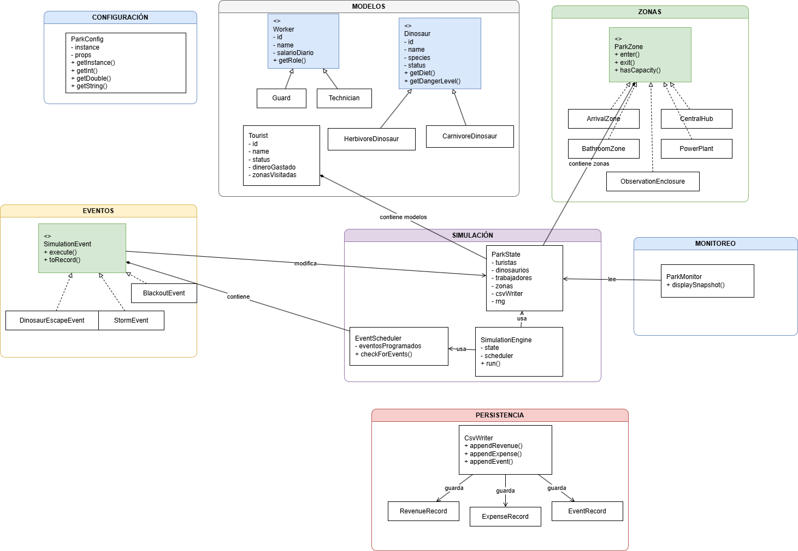
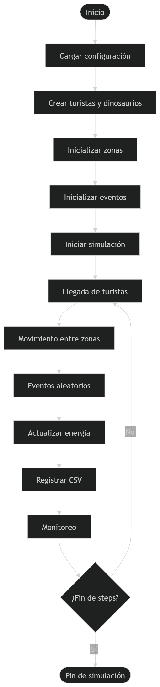

# Parque Turístico de Dinosaurios
**C_18_Vicente Luis Perez Grupo Basico**

## Descripción general

**Dinosaur Park** es un proyecto Maven desarrollado en Java para simular el funcionamiento básico de un parque turístico de dinosaurios.

El sistema modela el ingreso de turistas, la venta de boletos, la visita a zonas del parque, la observación de dinosaurios, el uso de servicios internos y la aparición de eventos aleatorios durante la simulación.

Durante cada paso de la simulación donde podemos cotrolar algunas variables como los turistas, cantidad de simulaciones y los datos aleatorios desde el archivo park.properties se actualiza el estado del parque, se procesan turistas, se ejecutan eventos, se revisa la planta de energía y se muestra un monitoreo en consola. Además, el proyecto genera archivos CSV para registrar ingresos, gastos y eventos relevantes.

## Tecnologías utilizadas

- Java 25 (es la que tenia ya instalada en mi PC)
- Maven
- JUnit 5
- Mockito
- JaCoCo
- Git y GitHub

## Estructura del proyecto

El código fuente se organiza en paquetes según la responsabilidad de cada módulo:

- `config`: carga de configuración del sistema mediante `ParkConfig`.
- `model`: entidades principales del dominio, como turistas, dinosaurios, trabajadores, tickets y encuestas.
- `zone`: zonas del parque, como llegada, baños, centro, recintos de observación y planta de energía.
- `event`: eventos básicos de la simulación, como escapes, tormentas y apagones.
- `persistence`: escritura de archivos CSV para ingresos, gastos y eventos.
- `simulation`: estado global, agenda de eventos y motor principal de simulación.
- `monitoring`: impresión de snapshots del estado actual del parque en consola.

## Diagramas del proyecto

Se incluyen los siguientes diagramas en el directorio `images/`:

- `images/diagrama-uml.png`: diagrama de clases del sistema.
- `images/flujo-simulacion.png`: flujo de la simulación.





## Patrones de diseño utilizados

### 1. Singleton

Se utiliza en `ParkConfig` para mantener una única instancia responsable de cargar y consultar los valores del archivo `park.properties`.

Esto permite centralizar la configuración de la simulación, como la semilla aleatoria, el número total de pasos y la cantidad de turistas.

### 2. Strategy / Uso de interfaces

La interfaz `ParkZone` define el comportamiento común de las zonas del parque.

Cada zona implementa su propia lógica de entrada, salida, capacidad y ocupación, manteniendo una estructura flexible y fácil de extender.

### 3. Herencia

El proyecto utiliza herencia para representar jerarquías del dominio:

- `Dinosaur` como clase base para `CarnivoreDinosaur` y `HerbivoreDinosaur`.
- `Worker` como clase base para `Guard` y `Technician`.

Esto permite compartir atributos comunes y especializar el comportamiento según el tipo de entidad.

## Funcionalidades principales

- Ingreso de turistas mediante la zona de llegada.
- Venta de boletos.
- Registro de visitas por zona.
- Observación de dinosaurios en recintos `BASIC`, `PREMIUM` y `VIP`.
- Compra de souvenirs en el centro del parque.
- Uso de baños y servicio SPA.
- Consumo y fallas de la planta de energía.
- Eventos aleatorios durante la simulación.
- Monitoreo del estado del parque en consola.
- Generación de archivos CSV con ingresos, gastos y eventos.

## Eventos aleatorios

El sistema programa eventos de forma determinista usando una semilla configurada en `park.properties`.

Los eventos implementados en el nivel básico son:

- **Escape de dinosaurio**: un dinosaurio puede escapar de su recinto y, dependiendo de su nivel de peligro, atacar a un turista.
- **Apagón masivo**: la planta de energía falla y se registra un gasto operativo.
- **Tormenta torrencial**: se registra una evacuación de turistas activos y un gasto operativo.

## Persistencia

El proyecto usa persistencia básica mediante archivos CSV. No utiliza base de datos, H2 ni `DatabaseService` que se pidio para otro niveles como este es para el nivel basico al final del dia es solo una simulacion .

Los archivos generados son:

- `output/revenues.csv`: registra ingresos por boletos, souvenirs, SPA y recintos.
- `output/expenses.csv`: registra gastos de mantenimiento, fallas y eventos operativos.
- `output/events.csv`: registra eventos importantes ocurridos durante la simulación.

## Ejecución del proyecto

### Compilar

```bash
mvn compile
```

### Ejecutar simulación

```bash
mvn exec:java '-Dexec.mainClass=com.axity.dinosaurpark.Main'
```

### Ejecutar tests

```bash
mvn test
```

## Cobertura de pruebas

El proyecto utiliza **JaCoCo** para medir la cobertura de pruebas unitarias.

La cobertura mínima configurada es de **45%** aunque se supera ese porcentaje . Las pruebas cubren módulos principales como modelos, configuración, zonas, eventos, persistencia y simulación.

Para ejecutar la verificación completa con cobertura:

```bash
mvn verify
```

## Diagrama de flujo / UML

Las siguientes referencias quedan preparadas para agregar posteriormente los diagramas del sistema:


## Autor

**C_18_Vicente Luis Perez Grupo Basico**
